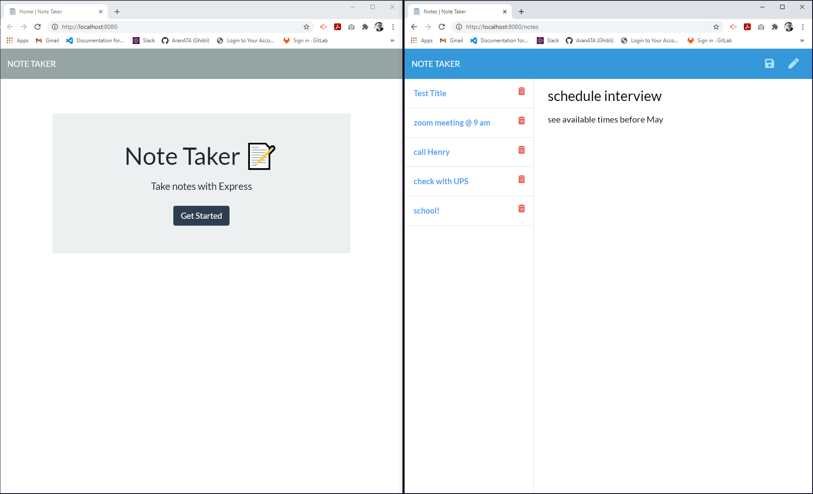

 

## **note taker** 
 

[https://aranata.github.io/note-taker/](https://aranata.github.io/note-taker/) 
 
 

## description

***
This application aims to organize the user's agenda and keep track of tasks through time in the form of a Note Taker. The user writes and saves notes as the saved entries can be accessed anytime. App's front end was given as a starter code and the newly created code handles the back end, connects the two, and then deploys the entire application to Heroku. This application uses an Express.js back end and saves and retrieves note data from a JSON file.

 
 

## acceptance criteria

***

The codebase achieves the following criteria: 

* GIVEN a note-taking application: 
* WHEN I open the Note Taker; THEN I am presented with a landing page with a link to a notes page 
* WHEN I click on the link to the notes page; THEN I am presented with a page with existing notes listed in the left-hand column, plus empty fields to enter a new note title and the note’s text in the right-hand column 
* WHEN I enter a new note title and the note’s text; THEN a Save icon appears in the navigation at the top of the page 
* WHEN I click on the Save icon; THEN the new note I have entered is saved and appears in the left-hand column with the other existing notes 
* WHEN I click on an existing note in the list in the left-hand column; THEN that note appears in the right-hand column 
* WHEN I click on the Write icon in the navigation at the top of the page; THEN I am presented with empty fields to enter a new note title and the note’s text in the right-hand column 
 
 

## usage

***

Full views of the home and notes pages  
 

 
 

A short video that shows how the UI works. 
 

 
 

## some valuable references

***

These notes and links are listing some valuable references among others that I used doing this project: 
 

[https://nodejs.dev/](https://nodejs.dev/)

[https://www.npmjs.com/package//inquirer#prompt](https://www.npmjs.com/package//inquirer#prompt)

[https://shields.io/category/dependencies/](https://shields.io/category/dependencies/)

[https://www.screencastify.com/](https://www.screencastify.com/)

 
 

## credits

***

Stephen Woosley - Bootcamp Instructor 
Patrick Haberern - Bootcamp TA 
Tim Nagorski - Bootcamp TA 
Sean Walmer - Bootcamp TA 
Alexis San Javier - Bootcamp Tutor 
 
 

## license

***

This is an assigment done under a bootcamp program, it is public but please contact the publisher before you use or
change any content. 
ghibli.github@gmail.com
 
 

## badges

***

 
 
